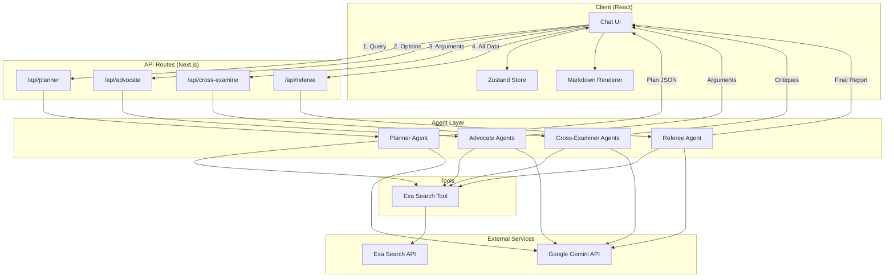

# Design Document: Tech Referee

## Overview

Tech Referee is a multi-agent AI debate system built with Next.js App Router and Vercel AI SDK. The system orchestrates four agent types (Planner, Advocate, Cross-Examiner, Referee) through separate API routes, enabling progressive UI updates and graceful error handling. Each agent uses Google Gemini (gemini-3-flash-preview) with Exa Search for web research.

The architecture follows a pipeline pattern where each phase produces structured output consumed by the next phase. State management uses Zustand with localStorage persistence for settings and comparison history.

## Architecture



## Components and Interfaces

### API Routes

#### `/api/planner` - POST

Receives user query, returns comparison plan with optional clarification questions.

```typescript
// Request
interface PlannerRequest {
  query: string;
  clarifications?: Record<string, string | string[]>;
}

// Response (streamed)
interface PlannerResponse {
  plan?: ComparisonPlan;
  clarifications?: ClarificationQuestion[];
  error?: string;
}

interface ComparisonPlan {
  options: string[]; // max 3
  constraints: Constraint[];
  axes: ComparisonAxis[];
  assignments: AdvocateAssignment[];
}

interface ClarificationQuestion {
  id: string;
  question: string;
  type: "single" | "multi" | "text";
  options?: string[];
  allowCustom: boolean;
}
```

#### `/api/advocate` - POST

Executes advocate agent for a single option.

```typescript
// Request
interface AdvocateRequest {
  option: string;
  plan: ComparisonPlan;
  sessionId: string;
}

// Response (streamed)
interface AdvocateResponse {
  option: string;
  argument: string; // Markdown with citations
  sources: Source[];
  weaknesses: string[];
  error?: string;
}

interface Source {
  title: string;
  url: string;
  snippet: string;
}
```

#### `/api/cross-examine` - POST

Executes cross-examination for a single advocate.

```typescript
// Request
interface CrossExamineRequest {
  option: string;
  ownArgument: AdvocateResponse;
  opponentArguments: AdvocateResponse[];
  plan: ComparisonPlan;
  sessionId: string;
}

// Response (streamed)
interface CrossExamineResponse {
  option: string;
  challenges: Challenge[];
  defense: string;
  error?: string;
}

interface Challenge {
  targetOption: string;
  claim: string;
  critique: string;
  factCheck?: FactCheckResult;
}
```

#### `/api/referee` - POST

Synthesizes all arguments into final recommendation.

```typescript
// Request
interface RefereeRequest {
  plan: ComparisonPlan;
  arguments: AdvocateResponse[];
  crossExaminations: CrossExamineResponse[];
  sessionId: string;
}

// Response (streamed)
interface RefereeResponse {
  summary: string; // Markdown with _Table, _Score keys
  scores: AxisScore[];
  tradeoffs: Tradeoff[];
  recommendation: Recommendation;
  caveats: string[];
  error?: string;
}

interface AxisScore {
  axis: string;
  scores: Record<string, number>; // option -> score (1-10)
}

interface Tradeoff {
  condition: string;
  recommendation: string;
}

interface Recommendation {
  option: string;
  reasoning: string;
  confidence: "high" | "medium" | "low";
}
```

### Agent Implementations

Each agent uses AI SDK functions with the Exa Search tool. The Google provider is configured with dynamic API key support:

```typescript
// lib/ai/provider.ts
import { createGoogleGenerativeAI } from "@ai-sdk/google";

export function getGoogleProvider(apiKey?: string) {
  return createGoogleGenerativeAI({
    apiKey: apiKey || process.env.GOOGLE_GENERATIVE_AI_API_KEY,
  });
}

export function getModel(
  apiKey?: string,
  modelId: string = "gemini-3-flash-preview"
) {
  const google = getGoogleProvider(apiKey);
  return google(modelId);
}
```

```typescript
// lib/ai/tools.ts
import { tool } from "ai";
import { z } from "zod";
import Exa from "exa-js";

export function createExaSearchTool(apiKey?: string) {
  const exa = new Exa(apiKey || process.env.EXA_API_KEY);

  return tool({
    description: "Search the web for up-to-date information",
    inputSchema: z.object({
      query: z.string().min(1).max(100).describe("The search query"),
    }),
    execute: async ({ query }) => {
      const { results } = await exa.searchAndContents(query, {
        livecrawl: "always",
        numResults: 5,
      });
      return results.map((result) => ({
        title: result.title,
        url: result.url,
        content: result.text.slice(0, 1500),
        publishedDate: result.publishedDate,
      }));
    },
  });
}
```

```typescript
// Example: Planner API route with structured output
import { generateText, Output } from "ai";
import { z } from "zod";

const ComparisonPlanSchema = z.object({
  options: z.array(z.string()).max(3),
  constraints: z.array(
    z.object({
      type: z.enum([
        "budget",
        "scale",
        "timeline",
        "must-have",
        "nice-to-have",
        "avoid",
      ]),
      description: z.string(),
      value: z.string().optional(),
    })
  ),
  axes: z.array(
    z.object({
      name: z.string(),
      description: z.string(),
      weight: z.number().min(1).max(10),
    })
  ),
  assignments: z.array(
    z.object({
      option: z.string(),
      advocateId: z.string(),
    })
  ),
});

// Using Output.object for structured generation
const { output } = await generateText({
  model: getModel(apiKey),
  output: Output.object({ schema: ComparisonPlanSchema }),
  system: PLANNER_SYSTEM_PROMPT,
  prompt: query,
  tools: { webSearch: createExaSearchTool(exaApiKey) },
});
```

```typescript
// Example: Streaming route handler
import { streamText, convertToModelMessages, UIMessage } from "ai";

export const maxDuration = 60; // Allow longer for agent execution

export async function POST(req: Request) {
  const {
    messages,
    apiKey,
    exaApiKey,
  }: {
    messages: UIMessage[];
    apiKey?: string;
    exaApiKey?: string;
  } = await req.json();

  const result = streamText({
    model: getModel(apiKey),
    system: ADVOCATE_SYSTEM_PROMPT,
    messages: await convertToModelMessages(messages),
    tools: { webSearch: createExaSearchTool(exaApiKey) },
  });

  return result.toUIMessageStreamResponse();
}
```

```typescript
// Client-side useChat with DefaultChatTransport
import { useChat } from "@ai-sdk/react";
import { DefaultChatTransport } from "ai";

const { messages, sendMessage } = useChat({
  transport: new DefaultChatTransport({
    api: "/api/advocate",
    body: () => ({
      apiKey: settingsStore.geminiApiKey,
      exaApiKey: settingsStore.exaApiKey,
    }),
  }),
});
```

### UI Components

#### `ComparisonChat`

Main chat interface managing the comparison flow.

```typescript
interface ComparisonChatProps {
  sessionId?: string;
}

// Internal state
interface ChatState {
  phase:
    | "input"
    | "planning"
    | "advocating"
    | "cross-examining"
    | "refereeing"
    | "complete";
  messages: ChatMessage[];
  plan?: ComparisonPlan;
  arguments?: AdvocateResponse[];
  crossExaminations?: CrossExamineResponse[];
  result?: RefereeResponse;
}
```

#### `PollComponent`

Interactive poll for clarification questions.

```typescript
interface PollComponentProps {
  question: ClarificationQuestion;
  onAnswer: (answer: string | string[]) => void;
}
```

#### `MemoizedMarkdown`

Optimized markdown renderer with custom component support.

```typescript
interface MemoizedMarkdownProps {
  content: string;
  id: string;
}

// Custom rendering keys:
// _Table{col1:type,col2:type}
// _Poll{opt1,opt2,opt3}
// _Score{axis:opt1=5,opt2=7,opt3=3}
```

#### `ScoreChart`

Visual comparison of scores across axes.

```typescript
interface ScoreChartProps {
  scores: AxisScore[];
  options: string[];
}
```

#### `ComparisonTable`

Styled table for side-by-side comparison.

```typescript
interface ComparisonTableProps {
  columns: TableColumn[];
  rows: TableRow[];
}
```

### State Management

#### Settings Store

```typescript
interface SettingsState {
  geminiApiKey: string;
  exaApiKey: string;
  model: string;
  maxParallelism: 1 | 2 | 3;

  setGeminiApiKey: (key: string) => void;
  setExaApiKey: (key: string) => void;
  setModel: (model: string) => void;
  setMaxParallelism: (n: 1 | 2 | 3) => void;
  hasRequiredKeys: () => boolean;
}
```

#### Session Store

```typescript
interface SessionState {
  sessions: ComparisonSession[];
  currentSessionId: string | null;

  createSession: (query: string) => string;
  updateSession: (id: string, data: Partial<ComparisonSession>) => void;
  deleteSession: (id: string) => void;
  getSession: (id: string) => ComparisonSession | undefined;
  setCurrentSession: (id: string | null) => void;
}

interface ComparisonSession {
  id: string;
  query: string;
  createdAt: Date;
  status:
    | "pending"
    | "planning"
    | "advocating"
    | "cross-examining"
    | "refereeing"
    | "complete"
    | "error";
  plan?: ComparisonPlan;
  arguments?: AdvocateResponse[];
  crossExaminations?: CrossExamineResponse[];
  result?: RefereeResponse;
  error?: string;
}
```

## Data Models

### Core Types

```typescript
// Constraint extracted from user query
interface Constraint {
  type:
    | "budget"
    | "scale"
    | "timeline"
    | "must-have"
    | "nice-to-have"
    | "avoid";
  description: string;
  value?: string;
}

// Comparison dimension
interface ComparisonAxis {
  name: string;
  description: string;
  weight: number; // 1-10, user importance
}

// Advocate assignment
interface AdvocateAssignment {
  option: string;
  advocateId: string;
}

// Fact check result from cross-examination
interface FactCheckResult {
  claim: string;
  verdict: "confirmed" | "disputed" | "unverifiable";
  evidence: string;
  sources: Source[];
}

// Table column definition for _Table rendering
interface TableColumn {
  name: string;
  type: "string" | "number" | "boolean";
}

// Table row for _Table rendering
interface TableRow {
  [key: string]: string | number | boolean;
}
```

### Agent System Prompts

```typescript
const PLANNER_SYSTEM_PROMPT = `You are a Planner agent for Tech Referee, a technical comparison system.

Your job is to:
1. Identify the options being compared (max 3)
2. Extract user constraints (budget, scale, timeline, must-haves)
3. Define comparison axes relevant to the query
4. Assign each option to an advocate

You may use web search to identify relevant options if the query is vague.

DO NOT make recommendations or perform deep analysis.

If the query is ambiguous, generate clarification questions using this format:
_Poll{option1,option2,option3}

Output a structured comparison plan in JSON format.`;

const ADVOCATE_SYSTEM_PROMPT = `You are an Advocate agent arguing FOR {option}.

Your job is to:
1. Research {option} thoroughly using web search
2. Build the strongest case addressing each comparison axis
3. Address how {option} meets user constraints
4. Cite sources for EVERY factual claim (include URLs)
5. Acknowledge weaknesses honestly (builds credibility)

Format your response in markdown. Use _Table for comparisons.`;

const CROSS_EXAMINER_SYSTEM_PROMPT = `You are a Cross-Examiner for {option}.

Your job is to:
1. Challenge weak or misleading claims from opponents
2. Point out what opponents omitted
3. Fact-check suspicious statements using web search
4. Defend {option} against criticism

Be rigorous but fair. Cite sources for fact-checks.`;

const REFEREE_SYSTEM_PROMPT = `You are the Referee agent synthesizing a technical comparison.

Your job is to:
1. Review all arguments and cross-examinations
2. Score each option on each axis (1-10)
3. Resolve factual disputes (fact-check if needed)
4. Identify trade-offs: "if X matters, choose A; if Y matters, choose B"
5. Make a recommendation based on user's constraints
6. Add caveats for when recommendation would change

Use these formatting keys:
- _Table{col1:type,col2:type} for comparison tables
- _Score{axis:opt1=N,opt2=N} for score displays

Be neutral and weight evidence by quality.`;
```

## Correctness Properties

_A property is a characteristic or behavior that should hold true across all valid executions of a system—essentially, a formal statement about what the system should do. Properties serve as the bridge between human-readable specifications and machine-verifiable correctness guarantees._

### Property 1: Query Routing

_For any_ user query submitted to the system, the query SHALL be passed to the Planner API route and return a valid response (either a plan or clarification questions).

**Validates: Requirements 1.1**

### Property 2: Ambiguous Query Handling

_For any_ query that lacks clear comparison options, the Planner SHALL return clarification questions with at least one poll-type question asking the user to specify options.

**Validates: Requirements 1.2, 2.2**

### Property 3: Clarification Incorporation

_For any_ set of clarification answers provided by the user, the resulting comparison plan SHALL reflect those answers in its options, constraints, or axes.

**Validates: Requirements 1.6**

### Property 4: Plan Output Validity

_For any_ valid query (with or without clarifications), the Planner output SHALL:

- Contain at most 3 options
- Include at least one comparison axis
- Have an advocate assignment for each option
- Not contain any recommendation
- Be valid JSON matching the ComparisonPlan schema

**Validates: Requirements 2.1, 2.4, 2.5, 2.6, 2.7, 2.8**

### Property 5: Advocate Output Completeness

_For any_ Advocate execution with a valid plan, the output SHALL:

- Address each comparison axis from the plan
- Reference user constraints
- Contain at least one URL citation
- Include a weaknesses section

**Validates: Requirements 3.2, 3.3, 3.4, 3.5**

### Property 6: Cross-Exam Input Validity

_For any_ Cross-Examiner execution, the input SHALL include the advocate's own argument AND all opponent arguments from the advocacy phase.

**Validates: Requirements 4.1**

### Property 7: Cross-Exam Output Completeness

_For any_ Cross-Examiner execution with valid input, the output SHALL:

- Contain at least one challenge to opponent arguments
- Include a defense section for their own option

**Validates: Requirements 4.2, 4.3, 4.5**

### Property 8: Referee Input Validity

_For any_ Referee execution, the input SHALL include the comparison plan, all advocate arguments, and all cross-examination results.

**Validates: Requirements 5.1**

### Property 9: Referee Output Completeness

_For any_ Referee execution with valid input, the output SHALL:

- Include scores for each option on each comparison axis
- Contain at least one tradeoff statement
- Include a recommendation with reasoning
- Include at least one caveat
- Contain at least one custom rendering key (\_Table or \_Score)

**Validates: Requirements 5.2, 5.4, 5.5, 5.6, 5.7**

### Property 10: Markdown Custom Key Parsing

_For any_ markdown string containing custom rendering keys (\_Table, \_Poll, \_Score), the parser SHALL correctly identify and extract all custom keys with their parameters.

**Validates: Requirements 6.1**

### Property 11: Session Store Round-Trip

_For any_ ComparisonSession object, saving it to the session store and then retrieving it by ID SHALL return an equivalent object.

**Validates: Requirements 8.1, 8.3**

## Error Handling

### API Error Responses

All API routes return structured error responses:

```typescript
interface APIError {
  error: string;
  code:
    | "INVALID_REQUEST"
    | "API_KEY_MISSING"
    | "API_KEY_INVALID"
    | "RATE_LIMITED"
    | "AGENT_FAILED"
    | "SEARCH_FAILED";
  details?: string;
  retryable: boolean;
}
```

### Error Scenarios

| Scenario             | Handling                                                |
| -------------------- | ------------------------------------------------------- |
| Missing API keys     | Return `API_KEY_MISSING`, prompt user to settings       |
| Invalid API keys     | Return `API_KEY_INVALID` after first failed call        |
| Gemini rate limit    | Retry up to 2 times with exponential backoff            |
| Exa search failure   | Continue with available info, note limitation in output |
| Agent timeout        | Return partial results if available                     |
| Invalid request body | Return `INVALID_REQUEST` with Zod validation errors     |

### Retry Logic

```typescript
async function withRetry<T>(
  fn: () => Promise<T>,
  maxRetries: number = 2,
  baseDelay: number = 1000
): Promise<T> {
  let lastError: Error;
  for (let i = 0; i <= maxRetries; i++) {
    try {
      return await fn();
    } catch (error) {
      lastError = error as Error;
      if (i < maxRetries && isRetryable(error)) {
        await sleep(baseDelay * Math.pow(2, i));
      }
    }
  }
  throw lastError;
}
```

### Partial Result Preservation

When a comparison cannot be completed, the system preserves partial results:

```typescript
interface PartialSession extends ComparisonSession {
  status: "error";
  error: string;
  completedPhases: ("planning" | "advocating" | "cross-examining")[];
}
```

## Testing Strategy

### Unit Tests

Unit tests focus on:

- Schema validation (Zod schemas for all interfaces)
- Markdown parser for custom keys
- Store operations (settings, sessions)
- Utility functions (retry logic, error handling)

### Property-Based Tests

Property tests use `fast-check` library with minimum 100 iterations per property:

```typescript
import fc from "fast-check";

// Example: Property 4 - Plan Output Validity
describe("Planner Output", () => {
  it("should produce valid plans for any query", async () => {
    await fc.assert(
      fc.asyncProperty(
        fc.string({ minLength: 10, maxLength: 500 }),
        async (query) => {
          const result = await callPlannerAPI({ query });

          if (result.plan) {
            expect(result.plan.options.length).toBeLessThanOrEqual(3);
            expect(result.plan.axes.length).toBeGreaterThan(0);
            expect(result.plan.assignments.length).toBe(
              result.plan.options.length
            );
            expect(result.plan).not.toHaveProperty("recommendation");
          }

          return true;
        }
      ),
      { numRuns: 100 }
    );
  });
});
```

### Component Tests

React component tests using React Testing Library:

- PollComponent renders options and handles selection
- MemoizedMarkdown renders custom keys correctly
- ScoreChart displays scores for all options
- ComparisonTable renders columns and rows

### Integration Tests

Integration tests verify the full flow:

- Query → Plan → Advocates → Cross-Exam → Referee
- Error recovery scenarios
- Session persistence across page reloads

### Test Configuration

```typescript
// vitest.config.ts (or bun test config)
export default {
  test: {
    environment: "jsdom",
    setupFiles: ["./test/setup.ts"],
    coverage: {
      provider: "v8",
      reporter: ["text", "html"],
    },
  },
};
```

### Mocking Strategy

- Mock Gemini API responses for deterministic tests
- Mock Exa Search for offline testing
- Use MSW (Mock Service Worker) for API route tests
