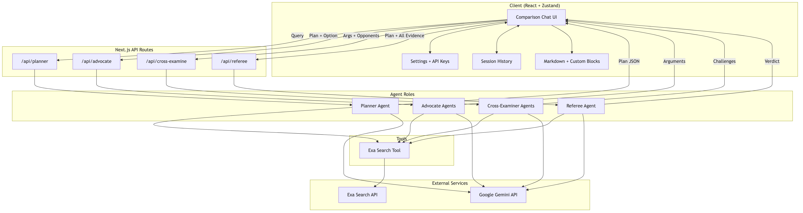

# Tech Referee (Debate Bench)

Tech Referee is a multi-agent comparison tool that helps users choose between technical options by running a structured debate. Instead of giving a single answer, it compares options, surfaces trade-offs, and delivers a balanced recommendation.

- Live app: https://debate-bench.vercel.app
- GitHub: https://github.com/connectednatural/agents-debate-bench/

## What It Does

- Builds a comparison plan from the user query (options, constraints, axes)
- Runs advocates in parallel to argue for each option with citations
- Cross-examines weak claims and missing context
- Synthesizes a final verdict with scores, trade-offs, and caveats

## Architecture



## Tech Stack

- Next.js App Router
- Vercel AI SDK
- Google Gemini (model: gemini-3-flash-preview)
- Exa Search for live citations
- Zustand for settings and session history
- Zod for schema validation

## Local Setup

```bash
npm install
npm run dev
```

Create a `.env.local` with:

```bash
GOOGLE_GENERATIVE_AI_API_KEY=your_key
EXA_API_KEY=your_key
```

## Project Structure

- `src/app/api/planner` - Planner agent route
- `src/app/api/advocate` - Advocate agent route
- `src/app/api/cross-examine` - Cross-examiner route
- `src/app/api/referee` - Referee agent route
- `src/lib/ai` - Prompts, tools, and model provider
- `src/lib/stores` - Settings and session history
